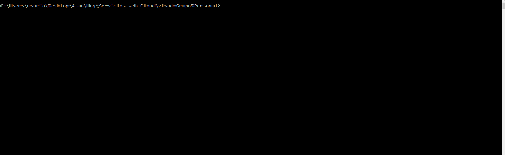

# Practical Work - UNQfy - Group 5
**Team members:**
 
 
&nbsp;&nbsp;&nbsp;&nbsp;&nbsp;&nbsp;&nbsp;&nbsp; • _Guzmán Sergio_
 
 
&nbsp;&nbsp;&nbsp;&nbsp;&nbsp;&nbsp;&nbsp;&nbsp; • _Velázquez Mariana_
 
 
&nbsp;&nbsp;&nbsp;&nbsp;&nbsp;&nbsp;&nbsp;&nbsp; • _Marino Alan_

# Important Information
To manipulate UNQfy correctly, the parameters that are Arrays must have to be declared with no spaces between separators.
 
 
Examples:
     
    &nbsp;&nbsp;&nbsp;&nbsp;&nbsp;&nbsp;&nbsp;&nbsp; ✓ &nbsp;&nbsp; ["Hard Rock","Samba"]
     
    &nbsp;&nbsp;&nbsp;&nbsp;&nbsp;&nbsp;&nbsp;&nbsp; ✗ &nbsp;&nbsp; ["Hard Rock", "Samba"] -> It's not correct because it have a white space.
 
 
# Interface to manipulate UNQfy

| COMMANDS                | FIRST PARAMETER                                           | SECOND PARAMETER                                    | THIRD PARAMETER                                    | FOURTH PARAMETER                 |
|-------------------------|-----------------------------------------------------------|-----------------------------------------------------|----------------------------------------------------|----------------------------------|
| **addArtist**             | **_country_** - The country where the Artist was founded      | **_name_** - The name of the Artist                     |
 - 
|
 - 
|
| **addAlbum**                | **_artistId_** - The id of the Artist to insert the new Album | **_name_** - The name of the Album                      | **_year_** - Year in which Album was released            |
 - 
|
| **addTrack**                | **_albumId_** - The id of the Album to insert the new Track   | **_name_** - The name of the Track                      | **_duration_** - The duration of the Track in seconds    | **_genres_** - The genres of the Track |
| **createPlaylist**          | **_name_** - The name of the Playlist                         | **_genres_** - The genres you want to include on Playlist | **_maxDuration_** - The maximum duration of the Playlist |
 - 
|
| **getArtistById**           | **_id_** - The id of the Artist                               |
 - 
|
 - 
|
 - 
|
| **getAlbumById**            | **_id_** - The id of the Artist                               |
 - 
|
 - 
|
 - 
|
| **getTrackById**            | **_id_** - The id of the Track                                |
 - 
|
 - 
|
 - 
|
| **getPlaylistById**         | **_id_** - The id of the Playlist                             |
 - 
|
 - 
|
 - 
|
| **removeArtistById**        | **_id_** - The id of the Artist                               |
 - 
|
 - 
|
 - 
|
| **removeAlbumById**         | **_id_** - The id of the Album                                |
 - 
|
 - 
|
 - 
|
| **removeTrackById**         | **_id_** - The id of the Track                                |
 - 
|
 - 
|
 - 
|
| **removePlaylistById**      | **_id_** - The id of the Playlist                             |
 - 
|
 - 
|
 - 
|
| **getTracksMatchingGenres** | **_genres_** - The genres to match tracks                       |
 - 
|
 - 
|
 - 
|
| **getTracksMatchingArtist** | **_id_** - The id of the Artist to get tracks                   |
 - 
|
 - 
|
 - 
|
| **searchByName**            | **_name_** - The name to match with all music instances         | 
 - 
| 
 - 
|
 - 
|

 

# Examples Using The Commands

 

## ⚫ Commands To Add A New Instance

 
 
 

## ⚫ Commands To Get An Instance

 
 
 

## ⚫ Commands To Remove An Instance

 
 
 

## ⚫ Commands To Do A Special Search

